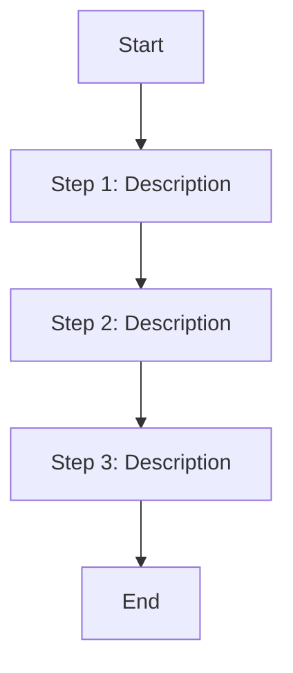

# Script Name Here


---

## Overview

This is a [brief description of the script]. This script [provide details on the purpose, function, and key benefits].

The script supports [specific features, platforms, or configurations].

---

## Features

- **Feature 1**: [Description of feature 1].
- **Feature 2**: [Description of feature 2].
- **Feature 3**: [Description of feature 3].
- **Feature 4**: [Description of feature 4].

---

## Usage

### Prerequisites

1. [System requirements, dependencies, or special setup instructions].
2. [List any external libraries or frameworks needed].

### Run the Script & Example Output

```bash
$ [command to execute script]

[Sample output of the script]
```

---

## Installation Steps

1. **Download the Script**\
   Save the `[script_name]` script to your local machine.

2. **Make It Executable**

   ```bash
   chmod +x [script_name]
   ```

3. **Run the Script**\
   Execute the script:

   ```bash
   ./[script_name]
   ```

---

## How It Works

1. **Step 1**: [Description of step 1].
2. **Step 2**: [Description of step 2].
3. **Step 3**: [Description of step 3].

---

## Process Flow



---

## Dependencies

- [Dependency 1]: [Details about dependency 1].
- [Dependency 2]: [Details about dependency 2].
- [Dependency 3]: [Details about dependency 3].

---

## License

This project is licensed under the MIT License. See the full text of the license below:

---

MIT License

Copyright (c) 2024 [Your Name]

Permission is hereby granted, free of charge, to any person obtaining a copy
of this software and associated documentation files (the "Software"), to deal
in the Software without restriction, including without limitation the rights
to use, copy, modify, merge, publish, distribute, sublicense, and/or sell
copies of the Software, and to permit persons to whom the Software is
furnished to do so, subject to the following conditions:

The above copyright notice and this permission notice shall be included in all
copies or substantial portions of the Software.

THE SOFTWARE IS PROVIDED "AS IS", WITHOUT WARRANTY OF ANY KIND, EXPRESS OR
IMPLIED, INCLUDING BUT NOT LIMITED TO THE WARRANTIES OF MERCHANTABILITY,
FITNESS FOR A PARTICULAR PURPOSE AND NONINFRINGEMENT. IN NO EVENT SHALL THE
AUTHORS OR COPYRIGHT HOLDERS BE LIABLE FOR ANY CLAIM, DAMAGES OR OTHER
LIABILITY, WHETHER IN AN ACTION OF CONTRACT, TORT OR OTHERWISE, ARISING FROM,
OUT OF OR IN CONNECTION WITH THE SOFTWARE OR THE USE OR OTHER DEALINGS IN THE
SOFTWARE.

---

