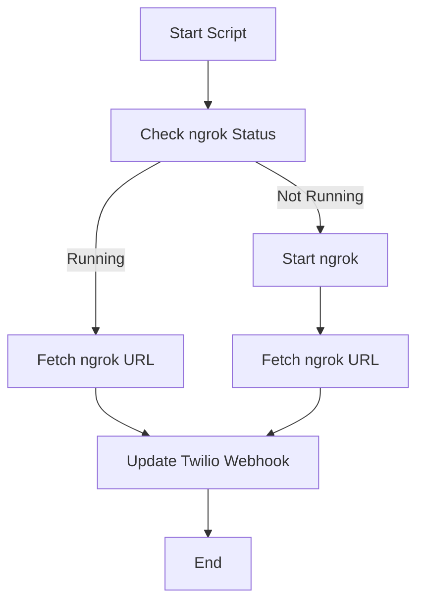

# ngrok URL and Twilio Webhook Updater

  
  
  


---

## Overview

This script automates the process of starting an ngrok tunnel, fetching its public HTTPS URL, and updating a Twilio phone number webhook with the generated URL. It is designed for developers who need to quickly expose local services to the internet for testing and development purposes.

The script supports dynamic webhook updates for both SMS and Voice functionalities in Twilio, simplifying development workflows.

## Note: You get one free unique domain at the time of this writing with your free ngrok account.  I didn't know that until after I created this script.  However this script still may be of value to show how to update remotely and programmatically your Twilio configuration.

---

## Features

- **Automated ngrok Start**: Starts an ngrok tunnel on a specified port if not already running.
- **Fetch ngrok Public URL**: Retrieves the HTTPS URL of the ngrok tunnel.
- **Twilio Webhook Update**: Updates Twilio phone number webhooks for SMS and Voice using the generated ngrok URL.
- **Retry Mechanism**: Retries fetching the ngrok URL up to 5 times for better reliability.

---

## Usage

### Prerequisites

1. **System Requirements**:
   - Python 3.6 or higher
   - ngrok installed and accessible via the command line
   - Twilio Account credentials: Account SID, Auth Token, and Phone SID

2. **Environment Variables**:
   Set the following environment variables:
   - `TWILIO_ACCOUNT_SID`: Your Twilio Account SID
   - `TWILIO_AUTH_TOKEN`: Your Twilio Auth Token
   - `TWILIO_PHONE_SID`: The SID of the Twilio phone number you wish to update

3. **Install Dependencies**:
   ```bash
   pip install twilio requests
   ```

---

### Run the Script from Command Line & Example Output

```bash
$ python3 ngrok-url-twilio-webhook-updater.py

ngrok started. Logs are being written to 'ngrok.log'
ngrok Public URL: https://1234-56-78-90.ngrok.io
Twilio webhook updated to: https://1234-56-78-90.ngrok.io
```

### Usage as Part of a Larger Script
To incorporate the script into a larger project, import it as a module and call its functions as needed. Example:
```python
from script_name import run_ngrok_and_update_twilio, start_ngrok, get_ngrok_url, update_twilio_webhook

# Example 1: Full workflow
run_ngrok_and_update_twilio(port=8080)

# Example 2: Manual steps
start_ngrok(port=8080)  # Start ngrok on a specific port
ngrok_url = get_ngrok_url()  # Retrieve the ngrok URL
if ngrok_url:
    print(f"ngrok URL: {ngrok_url}")
    update_twilio_webhook(ngrok_url)  # Update Twilio webhook
else:
    print("Failed to retrieve ngrok URL.")
```

---

## Installation Steps

1. **Download the Script**  
   Save the `ngrok-url-twilio-webhook-updater.py` script to your local machine.

2. **Run the Script**  
   Execute the script:
   ```bash
   python3 ngrok-url-twilio-webhook-updater.py
   ```

---

## How It Works

1. **Start ngrok**: Checks if ngrok is already running. If not, starts a new instance on the specified port (default: 5050).
2. **Fetch URL**: Queries the local ngrok API to retrieve the public HTTPS URL.
3. **Update Webhook**: Sends the URL to Twilio and updates the webhooks for SMS and Voice functionalities.

---

## Process Flow



---

## Dependencies

- **Python Libraries**:
  - `requests`: For HTTP requests to ngrok's local API
  - `twilio`: For interacting with Twilio's API
- **ngrok**: Local tunneling tool

---

## License

This project is licensed under the MIT License. See the full text of the license below:

---

MIT License

Copyright (c) 2024 [Your Name]

Permission is hereby granted, free of charge, to any person obtaining a copy
of this software and associated documentation files (the "Software"), to deal
in the Software without restriction, including without limitation the rights
to use, copy, modify, merge, publish, distribute, sublicense, and/or sell
copies of the Software, and to permit persons to whom the Software is
furnished to do so, subject to the following conditions:

The above copyright notice and this permission notice shall be included in all
copies or substantial portions of the Software.

THE SOFTWARE IS PROVIDED "AS IS", WITHOUT WARRANTY OF ANY KIND, EXPRESS OR
IMPLIED, INCLUDING BUT NOT LIMITED TO THE WARRANTIES OF MERCHANTABILITY,
FITNESS FOR A PARTICULAR PURPOSE AND NONINFRINGEMENT. IN NO EVENT SHALL THE
AUTHORS OR COPYRIGHT HOLDERS BE LIABLE FOR ANY CLAIM, DAMAGES OR OTHER
LIABILITY, WHETHER IN AN ACTION OF CONTRACT, TORT OR OTHERWISE, ARISING FROM,
OUT OF OR IN CONNECTION WITH THE SOFTWARE OR THE USE OR OTHER DEALINGS IN THE
SOFTWARE.

---
